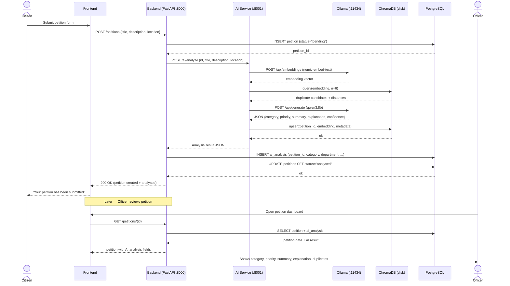

# AI Integration Guide

**InsightGov AI Module — Handoff Document for Backend & Frontend Engineers**

> **Version:** 1.0.0
> **Prepared by:** AI Module Lead
> **Date:** 2026-07-25
> **Based on:** Inspected source code in `d:/College/Projects/InsightGov/ai/`

---

## Table of Contents

1. [Overview](#1-overview)
2. [Service Information](#2-service-information)
3. [API Endpoints](#3-api-endpoints)
4. [Backend Integration](#4-backend-integration)
5. [Frontend Integration](#5-frontend-integration)
6. [AI Features](#6-ai-features)
7. [Configuration](#7-configuration)
8. [Integration Flow](#8-integration-flow)
9. [Deployment Notes](#9-deployment-notes)
10. [Testing](#10-testing)
11. [Limitations](#11-limitations)
12. [Future Improvements](#12-future-improvements)

---

## 1. Overview

### Purpose

The InsightGov AI service is a **local AI micro-service** that provides intelligent analysis of citizen petitions submitted through the InsightGov platform. It is an internal service called exclusively by the backend; it is **never called directly by the frontend**.

### Overall Architecture

```
┌─────────────┐      HTTP/REST      ┌──────────────────┐
│   Backend   │ ──────────────────► │  AI Service      │
│  (FastAPI)  │ ◄────────────────── │  (port 8001)     │
│  port 8000  │   JSON responses    └────────┬─────────┘
└─────────────┘                              │
                                   ┌─────────▼──────────────────┐
                                   │  Ollama (port 11434)        │
                                   │  ├─ qwen3:8b  (LLM)        │
                                   │  └─ nomic-embed-text (emb.) │
                                   └─────────────────────────────┘
                                   ┌─────────────────────────────┐
                                   │  ChromaDB (local disk)       │
                                   │  ./chroma_data/              │
                                   └─────────────────────────────┘
```

### Communication Flow

```
Citizen → Frontend → Backend → AI Service → Backend → Frontend
```

The backend is the **only caller** of the AI service. The frontend never communicates with the AI service directly.

### Responsibilities of the AI Module

| Responsibility | Implemented |
|---|:---:|
| Petition category classification | ✅ |
| Priority prediction | ✅ |
| Department resolution (deterministic) | ✅ |
| Executive summary generation | ✅ |
| Duplicate petition detection | ✅ |
| Petition embedding storage | ✅ |
| Semantic search over stored petitions | ✅ |
| Explainability (structured reasoning) | ✅ |

---

## 2. Service Information

### Base URL

```
http://localhost:8001
```

The port is configurable via the `AI_PORT` environment variable (default: `8001`).

### Interactive API Documentation

| UI | URL |
|---|---|
| Swagger UI | `http://localhost:8001/docs` |
| ReDoc | `http://localhost:8001/redoc` |

### Environment Variables

| Variable | Default | Description |
|---|---|---|
| `OLLAMA_BASE_URL` | `http://localhost:11434` | Base URL of the local Ollama server |
| `OLLAMA_LLM_MODEL` | `qwen3:8b` | Ollama model tag used for text generation |
| `OLLAMA_EMBED_MODEL` | `nomic-embed-text` | Ollama model tag used for generating embeddings |
| `CHROMA_PERSIST_DIR` | `./chroma_data` | Directory where ChromaDB stores its data on disk |
| `DUPLICATE_THRESHOLD` | `0.85` | Cosine similarity threshold (0.0–1.0) above which a petition is flagged as a duplicate |
| `AI_PORT` | `8001` | Port the AI service listens on |

### Required Ollama Models

The following models must be pulled in Ollama before the service can function:

```bash
ollama pull qwen3:8b
ollama pull nomic-embed-text
```

### Python Dependencies

| Package | Version | Purpose |
|---|---|---|
| `fastapi` | 0.111.0 | Web framework |
| `uvicorn[standard]` | 0.30.1 | ASGI server |
| `httpx` | 0.27.0 | Async HTTP client for Ollama calls |
| `chromadb` | 0.5.3 | Local vector database |
| `pydantic` | 2.7.1 | Data validation and serialisation |
| `python-dotenv` | 1.0.1 | `.env` file loading |

---

## 3. API Endpoints

The AI service exposes **three endpoints**:

| Method | URL | Purpose |
|---|---|---|
| `GET` | `/health` | Liveness and dependency check |
| `POST` | `/ai/analyze` | Full petition analysis |
| `POST` | `/ai/search` | Semantic search over stored petitions |

---

### 3.1 `GET /health`

**Purpose:** Verifies that the AI service is running and that both Ollama and ChromaDB are reachable. The backend should call this before sending petitions for analysis.

**Authentication:** None

**Request:** No body required.

**Response Schema:**

| Field | Type | Description |
|---|---|---|
| `status` | `string` | Always `"ok"` if the service itself is up |
| `ollama` | `string` | `"reachable"` or `"unreachable"` |
| `chromadb` | `string` | `"ok (documents=N)"` or `"error"` |

**Example Response — All Healthy (`200 OK`)**

```json
{
  "status": "ok",
  "ollama": "reachable",
  "chromadb": "ok (documents=42)"
}
```

**Example Response — Ollama Down (`200 OK`)**

```json
{
  "status": "ok",
  "ollama": "unreachable",
  "chromadb": "ok (documents=42)"
}
```

> [!NOTE]
> The `/health` endpoint always returns `200 OK` as long as the FastAPI process is running. The `ollama` and `chromadb` fields communicate dependency status. The backend should inspect these fields before calling `/ai/analyze`.

**HTTP Status Codes:**

| Code | Meaning |
|---|---|
| `200` | Service is running (check body fields for dependency status) |

---

### 3.2 `POST /ai/analyze`

**Purpose:** Runs the complete AI analysis pipeline on a single petition. Returns category, department, priority, executive summary, duplicate detection results, an explainability block, and a confidence score.

**Authentication:** None (internal service)

**Request Schema:**

| Field | Type | Required | Constraints | Description |
|---|---|---|---|---|
| `id` | `string` | ✅ | — | Unique petition identifier (UUID from the backend database) |
| `title` | `string` | ✅ | min_length=1 | Short title of the petition |
| `description` | `string` | ✅ | min_length=1 | Full petition description text |
| `location` | `string` | ✅ | min_length=1 | Location where the issue was reported |
| `submitted_by` | `string` | ❌ | — | Display name of the submitting citizen (optional, not used in analysis) |

**Example Request:**

```json
{
  "id": "3fa85f64-5717-4562-b3fc-2c963f66afa6",
  "title": "Broken streetlights on MG Road",
  "description": "The streetlights on MG Road between Gandhi Nagar and Civil Lines have been non-functional for the past three weeks, making the area unsafe at night.",
  "location": "MG Road, Gandhi Nagar, Delhi",
  "submitted_by": "Rajesh Kumar"
}
```

**Response Schema:**

| Field | Type | Description |
|---|---|---|
| `petition_id` | `string` | Echo of the submitted petition ID |
| `category` | `string` | Predicted category (see valid values below) |
| `department` | `string` | Resolved department name (from `department_mapping.json`) |
| `priority` | `string` | `low` \| `medium` \| `high` \| `critical` |
| `summary` | `string` | 2–3 sentence executive summary |
| `duplicate_ids` | `string[]` | IDs of previously analysed petitions with cosine similarity ≥ threshold |
| `similarity_scores` | `float[]` | Parallel cosine similarity scores for each `duplicate_id` |
| `explanation` | `object` | Structured AI reasoning (see sub-fields below) |
| `explanation.category_reason` | `string` | Why this category was chosen |
| `explanation.priority_reason` | `string` | Why this priority was assigned |
| `explanation.department_reason` | `string` | What type of government body should handle this |
| `confidence` | `float` | LLM confidence score (0.0–1.0) |
| `analyzed_at` | `string` (ISO 8601 UTC) | Timestamp of analysis |

**Example Response (`200 OK`):**

```json
{
  "petition_id": "3fa85f64-5717-4562-b3fc-2c963f66afa6",
  "category": "Infrastructure",
  "department": "Public Works Department",
  "priority": "high",
  "summary": "Residents of MG Road, Gandhi Nagar report that streetlights have been non-functional for three weeks. The darkness poses a significant safety risk, especially for pedestrians and late-night commuters. Immediate restoration of lighting is requested.",
  "duplicate_ids": [],
  "similarity_scores": [],
  "explanation": {
    "category_reason": "The petition concerns public street infrastructure (streetlights), which falls under the Infrastructure category.",
    "priority_reason": "Non-functional streetlights over an extended period create a public safety hazard affecting a broad area, warranting high priority.",
    "department_reason": "Maintenance of public road infrastructure and lighting is the responsibility of the Public Works or Municipal body."
  },
  "confidence": 0.92,
  "analyzed_at": "2026-07-25T06:00:00Z"
}
```

**Example Response — Duplicate Detected (`200 OK`):**

```json
{
  "petition_id": "aabbccdd-0000-0000-0000-000000000099",
  "category": "Infrastructure",
  "department": "Public Works Department",
  "priority": "high",
  "summary": "...",
  "duplicate_ids": ["3fa85f64-5717-4562-b3fc-2c963f66afa6"],
  "similarity_scores": [0.9312],
  "explanation": { ... },
  "confidence": 0.88,
  "analyzed_at": "2026-07-25T07:30:00Z"
}
```

**HTTP Status Codes:**

| Code | Meaning |
|---|---|
| `200` | Analysis completed successfully |
| `422` | Request body validation failed (missing required fields or wrong types) |
| `500` | Internal error — Ollama unreachable, LLM failed after 3 retries, or ChromaDB error |

**Error Response (`500`):**

```json
{
  "detail": "Petition analysis failed: LLM generation failed after 3 attempts. Last error: ..."
}
```

**Error Response (`422`):**

```json
{
  "detail": [
    {
      "type": "missing",
      "loc": ["body", "title"],
      "msg": "Field required"
    }
  ]
}
```

---

### 3.3 `POST /ai/search`

**Purpose:** Performs semantic (vector) search over all petitions that have previously been analysed and stored in ChromaDB. Returns the top-k most similar petitions ordered by cosine similarity score.

**Authentication:** None (internal service)

**Request Schema:**

| Field | Type | Required | Constraints | Description |
|---|---|---|---|---|
| `query` | `string` | ✅ | min_length=1 | Natural language search query |
| `top_k` | `integer` | ❌ | ge=1, le=50, default=5 | Maximum number of results to return |
| `filters` | `object` | ❌ | — | Reserved for future use; currently ignored |

**Example Request:**

```json
{
  "query": "road damage and pothole complaints",
  "top_k": 5
}
```

**Response Schema:**

| Field | Type | Description |
|---|---|---|
| `results` | `SearchResultItem[]` | Ranked list of matching petitions |
| `results[].petition_id` | `string` | Petition UUID |
| `results[].score` | `float` | Cosine similarity score (0.0–1.0; higher = more similar) |
| `results[].title` | `string` | Petition title (from ChromaDB metadata) |
| `results[].description` | `string` | Petition text document (stored in ChromaDB) |
| `results[].category` | `string` | Petition category (from ChromaDB metadata) |

**Example Response (`200 OK`):**

```json
{
  "results": [
    {
      "petition_id": "abc12345-0000-0000-0000-000000000001",
      "score": 0.91,
      "title": "Pothole on Ring Road",
      "description": "Title: Pothole on Ring Road\nDescription: Large potholes near the junction causing accidents.\nLocation: Ring Road, Delhi",
      "category": "Infrastructure"
    },
    {
      "petition_id": "def67890-0000-0000-0000-000000000002",
      "score": 0.83,
      "title": "Damaged road near school",
      "description": "Title: Damaged road near school\nDescription: Road has craters making it difficult for school buses.\nLocation: Sector 12, Noida",
      "category": "Infrastructure"
    }
  ]
}
```

**Example Response — Empty Collection (`200 OK`):**

```json
{
  "results": []
}
```

> [!NOTE]
> If no petitions have been analysed yet (ChromaDB collection is empty), `/ai/search` returns an empty `results` array with `200 OK`. It does **not** return an error.

**HTTP Status Codes:**

| Code | Meaning |
|---|---|
| `200` | Search completed (may return empty results) |
| `422` | Request validation failed |
| `500` | Internal error (Ollama or ChromaDB failure) |

**Error Response (`500`):**

```json
{
  "detail": "Semantic search failed: ..."
}
```

---

## 4. Backend Integration

### Which Endpoints to Call

| Scenario | Endpoint | When |
|---|---|---|
| New petition submitted | `POST /ai/analyze` | Immediately after the petition is persisted to PostgreSQL |
| Officer searches for similar cases | `POST /ai/search` | When the officer dashboard search is triggered |
| Service readiness check | `GET /health` | On backend startup or before the first call |

### Petition Workflow Integration

```
1. Citizen submits petition via frontend
2. Backend validates and saves petition to PostgreSQL (status: "pending")
3. Backend calls POST /ai/analyze with the petition's id, title, description, location
4. AI service returns AnalysisResult
5. Backend saves the analysis to the `ai_analysis` table in PostgreSQL
6. Backend updates petition status to "analysed"
7. Backend optionally flags petition as duplicate if duplicate_ids is non-empty
8. Backend assigns petition to the department resolved by the AI
```

### What to Store in PostgreSQL

Store the following fields from the `AnalysisResult` in the `ai_analysis` table:

| Field | Source | Notes |
|---|---|---|
| `petition_id` | `AnalysisResult.petition_id` | Foreign key to `petitions` table |
| `category` | `AnalysisResult.category` | Predicted category string |
| `department` | `AnalysisResult.department` | Resolved department name |
| `priority` | `AnalysisResult.priority` | `low/medium/high/critical` |
| `summary` | `AnalysisResult.summary` | Executive summary text |
| `duplicate_ids` | `AnalysisResult.duplicate_ids` | Store as JSON array |
| `similarity_scores` | `AnalysisResult.similarity_scores` | Parallel to `duplicate_ids`; store as JSON array |
| `explanation` | `AnalysisResult.explanation` | Store as JSON object |
| `confidence` | `AnalysisResult.confidence` | Float 0.0–1.0 |
| `analyzed_at` | `AnalysisResult.analyzed_at` | UTC timestamp |

### What the AI Service Never Stores

- The AI service **does not write to PostgreSQL**. It is completely stateless with respect to the relational database.
- The AI service stores embeddings and text in **ChromaDB only** (local vector store).
- The backend is solely responsible for PostgreSQL persistence.

### Failure Handling

| Scenario | Recommended Backend Behaviour |
|---|---|
| AI service returns `500` | Log the error; keep petition status as `"pending"`; do not crash the petition submission flow |
| AI service is unreachable | Proceed with petition submission; mark analysis as `"pending"`; queue for retry |
| LLM timeout (> 120s) | The AI service will retry internally up to 3 times before returning `500` |
| `duplicate_ids` is non-empty | Backend should flag the petition and surface the duplicates to the reviewing officer |

### Retry Behaviour (Implemented in AI Service)

The AI service's `llm_service.py` already retries Ollama calls up to **3 times** on any exception. The backend does **not** need to implement LLM-level retries. However, the backend should implement its own retry for the HTTP call to the AI service (e.g., 1 retry with a short delay) to handle transient network issues.

---

## 5. Frontend Integration

> [!IMPORTANT]
> The frontend **never calls the AI service directly**. All AI data is fetched from the backend API, which persists it from the AI service response.

### AI-Generated Fields Available for Display

All fields below come from the `ai_analysis` table (populated by the backend from the AI service response).

#### Petition Analysis View (Officer Dashboard)

| Field | Display Purpose | Recommended UI Treatment |
|---|---|---|
| `category` | Badge/tag on petition card | Coloured label (e.g., Infrastructure = blue) |
| `department` | Routing info for officer | Displayed as assigned department |
| `priority` | Urgency indicator | Coloured badge: `critical`=red, `high`=orange, `medium`=yellow, `low`=green |
| `summary` | Quick overview for officer | Shown in a summary card before full petition text |
| `confidence` | AI reliability indicator | Progress bar or percentage display (0–100%) |
| `analyzed_at` | Audit trail | Small timestamp text |

#### Explainability Panel (Officer Decision Support)

| Field | Display Purpose |
|---|---|
| `explanation.category_reason` | "Why was this categorised as X?" |
| `explanation.priority_reason` | "Why is this high priority?" |
| `explanation.department_reason` | "Why was this routed to this department?" |

These fields are specifically designed for **officer decision support**. Display them in a collapsible "AI Reasoning" panel so officers can understand and override AI decisions.

#### Duplicate Alerts

| Field | Display Purpose |
|---|---|
| `duplicate_ids` | List of petition IDs the officer can click to review |
| `similarity_scores` | Show as percentage similarity next to each duplicate link |

If `duplicate_ids` is a non-empty array, show a banner: _"⚠ This petition may be a duplicate of N existing petition(s)."_

### Fields Suitable for Officer Decision Support

The following fields are specifically designed to support (not replace) officer decisions:

- `priority` — recommended urgency, can be overridden
- `department` — recommended routing, can be overridden
- `explanation` — the AI's reasoning, enabling informed override
- `duplicate_ids` — officer should manually verify before merging

### UI Recommendations

1. **Never display AI output as final.** Always label it as "AI Recommendation" or "AI Suggestion."
2. **Show the confidence score** so officers calibrate trust. Confidence below `0.60` should trigger a visual caution indicator.
3. **Display the explanation block** in a collapsible section, not as primary content, to avoid overwhelming officers.
4. **Duplicate warnings** should be prominent (banner or alert), not buried in metadata.
5. **`analyzed_at` timestamp** should be shown so officers know how recent the analysis is.

---

## 6. AI Features

### 6.1 Petition Analysis (Orchestrator)

**What it does:** Coordinates the full analysis pipeline for a single petition. This is the entry point to all other AI features.

**Input:** `id`, `title`, `description`, `location` (from `PetitionAnalyzeRequest`)

**Output:** `AnalysisResult` — aggregated result of all sub-features

**Dependencies:** `embedding_service`, `duplicate_service`, `llm_service`, `department_mapping.json`

**Internal pipeline order:**
1. Generate embedding → 2. Find duplicates → 3. LLM analysis → 4. Resolve department → 5. Store in ChromaDB → 6. Return result

---

### 6.2 Category Classification

**What it does:** Classifies the petition into one of 13 predefined government categories using the LLM.

**Input:** Petition title, description, and location (formatted as a single text block)

**Output:** One of the following string values:

```
Infrastructure, Health, Education, Water, Electricity, Sanitation,
Transport, Housing, Agriculture, Law & Order, Environment, Finance, Other
```

**Dependencies:** `llm_service`, `prompts/analysis.md`

**Fallback:** If the LLM returns a category not in the mapping, the service falls back to `"Other"`.

---

### 6.3 Priority Prediction

**What it does:** Assigns one of four priority levels to the petition based on urgency, number of people likely affected, and public safety risk.

**Input:** Petition title, description, and location (via LLM)

**Output:** One of: `low` | `medium` | `high` | `critical`

**Criteria (from prompt):**
- `low` — Minor inconvenience, few people affected, no immediate safety risk
- `medium` — Moderate impact, multiple people affected, needs attention within weeks
- `high` — Significant impact, many people affected, requires prompt action
- `critical` — Immediate public safety risk, large population affected

**Dependencies:** `llm_service`, `prompts/analysis.md`

**Fallback:** If the LLM omits the field, the service defaults to `"medium"`.

---

### 6.4 Department Resolution

**What it does:** Maps the predicted category to an official government department name. This mapping is **deterministic** — the LLM is **not** asked to produce department names.

**Input:** `category` string from the LLM output

**Output:** Official department name string

**Mapping table (from `department_mapping.json`):**

| Category | Department |
|---|---|
| Infrastructure | Public Works Department |
| Health | Department of Health and Family Welfare |
| Education | Department of Education |
| Water | Water Supply and Sanitation Department |
| Electricity | Department of Power |
| Sanitation | Department of Municipal Administration |
| Transport | Department of Transport |
| Housing | Department of Housing |
| Agriculture | Department of Agriculture |
| Law & Order | Department of Police |
| Environment | Department of Environment and Forests |
| Finance | Department of Finance |
| Other | General Administration Department |

**Dependencies:** `department_mapping.json` (loaded once at startup from disk)

---

### 6.5 Executive Summary

**What it does:** Generates a 2–3 sentence executive summary of the petition in formal government language, suitable for review by a senior officer.

**Input:** Petition title, description, and location (via LLM)

**Output:** Plain text string (2–3 sentences)

**Dependencies:** `llm_service`, `prompts/analysis.md`

> [!NOTE]
> The summary is generated as part of the main analysis call (`POST /ai/analyze`). The `prompts/summary.md` file contains a separate standalone prompt but it is **not wired to any endpoint** in the current implementation. It is available for future use.

---

### 6.6 Duplicate Detection

**What it does:** Before storing the new petition, queries ChromaDB for previously analysed petitions with a cosine similarity above the configured threshold. Returns the IDs and scores of matching petitions.

**Input:** Petition embedding vector, petition ID (to exclude self-matches)

**Output:** `duplicate_ids: string[]`, `similarity_scores: float[]` (parallel arrays)

**Threshold:** Configurable via `DUPLICATE_THRESHOLD` (default: `0.85`)

**Distance metric:** Cosine distance. Similarity is computed as `1 - distance`.

**Dependencies:** `embedding_service`, ChromaDB (`utils/chroma_client.py`)

**Behaviour when collection is empty:** Returns empty arrays immediately without querying ChromaDB.

---

### 6.7 Semantic Search

**What it does:** Embeds a natural language query and returns the top-k most similar petitions from ChromaDB, ordered by cosine similarity score (descending).

**Input:** `query` (string), `top_k` (integer, 1–50, default 5)

**Output:** `results: SearchResultItem[]` — each item contains `petition_id`, `score`, `title`, `description`, `category`

**Dependencies:** `embedding_service`, ChromaDB

**Behaviour when collection is empty:** Returns an empty `results` array immediately.

**Note on `description` field in results:** The stored document in ChromaDB is the formatted petition text (`Title: ...\nDescription: ...\nLocation: ...`), not just the description field.

---

### 6.8 Explainability

**What it does:** For every analysis, the LLM produces a structured `explanation` block with three plain-language justifications covering the category, priority, and department-type decisions.

**Input:** Petition content (via LLM)

**Output:**

```json
{
  "explanation": {
    "category_reason": "Why this category was chosen.",
    "priority_reason": "Why this priority was assigned.",
    "department_reason": "What type of government body should handle this."
  }
}
```

**Dependencies:** `llm_service`, `prompts/analysis.md`

**Fallback:** If the LLM omits any sub-field, it defaults to an empty string `""`.

---

## 7. Configuration

### Environment Variables

Copy `.env.example` to `.env` and adjust as needed:

```bash
cp .env.example .env
```

Full reference:

```dotenv
# Ollama server base URL
OLLAMA_BASE_URL=http://localhost:11434

# LLM model tag used for text generation (must be pulled in Ollama)
OLLAMA_LLM_MODEL=qwen3:8b

# Embedding model tag (must be pulled in Ollama)
OLLAMA_EMBED_MODEL=nomic-embed-text

# Directory where ChromaDB persists data on disk
CHROMA_PERSIST_DIR=./chroma_data

# Cosine similarity threshold for duplicate detection (0.0–1.0)
DUPLICATE_THRESHOLD=0.85

# Port the AI service listens on
AI_PORT=8001
```

### `department_mapping.json`

Located at `ai/department_mapping.json`. This file controls deterministic department routing. To add or rename a department:

1. Open `ai/department_mapping.json`
2. Add or modify the `"Category": "Department Name"` entry
3. Restart the AI service (the file is loaded once at module import time)

No Python code changes are needed.

### Prompt Files

Located at `ai/prompts/`. These are plain text (Markdown) files loaded at runtime.

| File | Used By | Purpose |
|---|---|---|
| `analysis.md` | `analysis_service.py` | System prompt for full petition analysis |
| `summary.md` | Not wired yet | Standalone executive summary prompt (future use) |

To modify the LLM's behaviour, edit the prompt file and restart the service. No code changes required.

### ChromaDB Storage

- **Mode:** `PersistentClient` (data written to disk)
- **Default path:** `./chroma_data/` (relative to the `ai/` directory)
- **Collection name:** `petitions`
- **Distance metric:** Cosine (`hnsw:space: cosine`)
- **Data stored per document:** embedding vector, petition text, metadata (`title`, `location`, `category`)

> [!WARNING]
> Deleting the `chroma_data/` directory will erase all stored embeddings. Duplicate detection and semantic search will return no results until petitions are re-analysed.

### Ollama Models

| Model | Tag | Role | Ollama API Used |
|---|---|---|---|
| Qwen3 | `qwen3:8b` | LLM — analysis, classification, summarisation | `/api/generate` |
| nomic-embed-text | `nomic-embed-text` | Embedding generation | `/api/embeddings` |

---

## 8. Integration Flow

### Step-by-Step Sequence

**Step 1 — Citizen submits petition**
The citizen fills out the petition form on the frontend and submits.

**Step 2 — Frontend → Backend**
The frontend sends a `POST /petitions` request to the backend with petition data.

**Step 3 — Backend persists petition**
The backend validates the data and saves the petition to PostgreSQL with status `"pending"`.

**Step 4 — Backend → AI Service (`POST /ai/analyze`)**
The backend sends the petition's `id`, `title`, `description`, and `location` to the AI service.

**Step 5 — AI Service internal pipeline**
1. Generates a text embedding via Ollama `nomic-embed-text`
2. Queries ChromaDB for similar petitions (duplicate detection)
3. Calls Ollama `qwen3:8b` for category, priority, summary, explanation, and confidence
4. Resolves the department from `department_mapping.json`
5. Stores the petition embedding in ChromaDB
6. Returns `AnalysisResult` JSON to the backend

**Step 6 — Backend stores analysis**
The backend saves the `AnalysisResult` to the `ai_analysis` table in PostgreSQL and updates the petition status to `"analysed"`.

**Step 7 — Backend → Frontend**
The frontend polls or is notified that analysis is complete, then fetches the petition details (including AI analysis) from the backend.

**Step 8 — Officer reviews analysis**
The officer views the AI recommendation (category, department, priority, summary, explanation) and makes a final decision.

### Mermaid Sequence Diagram



---

## 9. Deployment Notes

### Required Services

All three services must be running for full functionality:

| Service | How to Start | Default Port |
|---|---|---|
| Ollama | `ollama serve` | `11434` |
| AI Service | `uvicorn main:app --port 8001` | `8001` |
| Backend | (backend team's responsibility) | `8000` |

### Startup Order

```
1. Start Ollama first          → ollama serve
2. Pull required models        → ollama pull qwen3:8b && ollama pull nomic-embed-text
3. Start AI Service            → uvicorn main:app --reload --port 8001
4. Start Backend               → (backend team)
5. Verify AI health            → GET http://localhost:8001/health
```

> [!IMPORTANT]
> The AI service will start even if Ollama is not running. However, all calls to `/ai/analyze` and `/ai/search` will fail with `500` until Ollama is reachable. Always verify `/health` after startup.

### Installing AI Service Dependencies

```bash
cd d:/College/Projects/InsightGov/ai
pip install -r requirements.txt
cp .env.example .env
# Edit .env if your Ollama URL or port differs from defaults
```

### Starting the AI Service

```bash
# Development (with auto-reload)
uvicorn main:app --reload --port 8001

# Production
uvicorn main:app --host 0.0.0.0 --port 8001 --workers 1
```

> [!NOTE]
> Use `--workers 1` in production. The ChromaDB collection uses a module-level singleton that is not safe for multi-worker processes.

### Required Ports

| Port | Service |
|---|---|
| `11434` | Ollama |
| `8001` | AI Service |
| `8000` | Backend (assumed) |

### Health Check Endpoint

```
GET http://localhost:8001/health
```

Use this endpoint to:
- Verify the AI service started correctly
- Check Ollama model availability
- Check ChromaDB data directory accessibility

### Common Startup Issues

| Problem | Symptom | Fix |
|---|---|---|
| Ollama not running | `"ollama": "unreachable"` in `/health` | Run `ollama serve` |
| Model not pulled | `500` on `/ai/analyze` with model error | `ollama pull qwen3:8b` and `ollama pull nomic-embed-text` |
| Wrong Ollama port | `"ollama": "unreachable"` | Set `OLLAMA_BASE_URL` in `.env` |
| ChromaDB permission error | `500` on startup / `"chromadb": "error"` | Ensure the process has write access to `CHROMA_PERSIST_DIR` |
| `.env` not loaded | Config uses wrong defaults | Ensure `.env` exists in `ai/` directory |
| Port 8001 in use | `Address already in use` on startup | Change `AI_PORT` or kill the conflicting process |

---

## 10. Testing

### 10.1 Verify `/health`

```bash
curl -X GET http://localhost:8001/health
```

**Expected response (all healthy):**

```json
{
  "status": "ok",
  "ollama": "reachable",
  "chromadb": "ok (documents=0)"
}
```

If `ollama` is `"unreachable"`, check that Ollama is running on port 11434.

---

### 10.2 Verify `/ai/analyze`

```bash
curl -X POST http://localhost:8001/ai/analyze \
  -H "Content-Type: application/json" \
  -d '{
    "id": "test-petition-001",
    "title": "Broken streetlights on MG Road",
    "description": "The streetlights on MG Road between Gandhi Nagar and Civil Lines have been non-functional for the past three weeks, making the area unsafe at night.",
    "location": "MG Road, Gandhi Nagar, Delhi"
  }'
```

**Expected response (`200 OK`):**

```json
{
  "petition_id": "test-petition-001",
  "category": "Infrastructure",
  "department": "Public Works Department",
  "priority": "high",
  "summary": "...",
  "duplicate_ids": [],
  "similarity_scores": [],
  "explanation": {
    "category_reason": "...",
    "priority_reason": "...",
    "department_reason": "..."
  },
  "confidence": 0.9,
  "analyzed_at": "2026-07-25T..."
}
```

**Checklist:**
- `petition_id` matches the submitted `id`
- `category` is one of the 13 valid values
- `department` is a non-empty string from `department_mapping.json`
- `priority` is one of `low | medium | high | critical`
- `explanation` has all three sub-fields populated
- `confidence` is between `0.0` and `1.0`
- `analyzed_at` is a valid ISO 8601 UTC timestamp

---

### 10.3 Verify Duplicate Detection

Analyse the same petition twice (same content, different IDs):

```bash
# First analysis
curl -X POST http://localhost:8001/ai/analyze \
  -H "Content-Type: application/json" \
  -d '{
    "id": "petition-original-001",
    "title": "Waterlogging near City Park",
    "description": "Severe waterlogging near City Park after rain. Residents cannot walk on footpaths.",
    "location": "City Park, Sector 5, Noida"
  }'

# Second analysis (near-duplicate)
curl -X POST http://localhost:8001/ai/analyze \
  -H "Content-Type: application/json" \
  -d '{
    "id": "petition-duplicate-002",
    "title": "Flood-like conditions near City Park",
    "description": "The area near City Park is completely waterlogged after rain. Footpaths are submerged.",
    "location": "City Park, Sector 5, Noida"
  }'
```

**Expected:** The second response should include:

```json
{
  "duplicate_ids": ["petition-original-001"],
  "similarity_scores": [0.9XXX]
}
```

---

### 10.4 Verify `/ai/search`

First, ensure at least one petition has been analysed (ChromaDB must not be empty).

```bash
curl -X POST http://localhost:8001/ai/search \
  -H "Content-Type: application/json" \
  -d '{
    "query": "waterlogging and flooding",
    "top_k": 3
  }'
```

**Expected response (`200 OK`):**

```json
{
  "results": [
    {
      "petition_id": "...",
      "score": 0.87,
      "title": "...",
      "description": "...",
      "category": "..."
    }
  ]
}
```

**Empty collection test:**

```bash
# If ChromaDB is empty, expect:
{
  "results": []
}
```

---

### 10.5 Verify Validation Error

```bash
curl -X POST http://localhost:8001/ai/analyze \
  -H "Content-Type: application/json" \
  -d '{
    "title": "Missing ID field"
  }'
```

**Expected: `422 Unprocessable Entity`**

```json
{
  "detail": [
    {
      "type": "missing",
      "loc": ["body", "id"],
      "msg": "Field required"
    }
  ]
}
```

---

## 11. Limitations

The following are **known limitations** of the current hackathon implementation:

1. **Single-worker only** — ChromaDB uses a module-level singleton. Running multiple Uvicorn workers will cause shared state issues.
2. **No authentication** — The AI service has no API key or token validation. It relies entirely on network-level isolation (internal service only).
3. **No request queuing** — Concurrent analysis requests all hit Ollama simultaneously. Ollama processes requests sequentially; under high concurrency, requests will timeout.
4. **LLM timeout is fixed at 120 seconds** — There is no dynamic timeout adjustment based on model load.
5. **No exponential backoff on retries** — The LLM retry loop attempts immediately without any delay between retries.
6. **ChromaDB stores all petitions indefinitely** — There is no eviction, archival, or size limit on the vector store.
7. **`filters` field in `/ai/search` is reserved but not implemented** — Passing filters has no effect on results.
8. **`submitted_by` field is accepted but not used** — It is part of the schema for future use but plays no role in analysis.
9. **`prompts/summary.md` is not wired to any endpoint** — The standalone summary feature is defined but not exposed.
10. **Department mapping is static** — New categories require editing `department_mapping.json` and restarting the service.
11. **No persistence across ChromaDB resets** — If `chroma_data/` is deleted, all duplicate detection history is lost.
12. **Duplicate detection is limited to top 6 candidates** — Only the 6 nearest neighbours are considered for deduplication, regardless of collection size.
13. **No input length limit** — Very long petition descriptions may cause Ollama to exceed context window limits.

---

## 12. Future Improvements

### Current Implementation

| Feature | Status |
|---|---|
| Petition analysis (category, priority, summary, explanation) | ✅ Implemented |
| Department routing via JSON mapping | ✅ Implemented |
| Duplicate detection via cosine similarity | ✅ Implemented |
| Semantic search over stored petitions | ✅ Implemented |
| Health check endpoint | ✅ Implemented |
| LLM retry (3 attempts) | ✅ Implemented |
| Configurable prompts (data files) | ✅ Implemented |
| Configurable department mapping | ✅ Implemented |

### Possible Future Enhancements

| Enhancement | Description |
|---|---|
| **API authentication** | Add an API key or shared secret between the backend and AI service |
| **Request queue / rate limiting** | Queue analysis requests to prevent Ollama overload under high concurrency |
| **Exponential backoff on retries** | Add delay between LLM retry attempts to reduce hammering under load |
| **Batch analysis endpoint** | `POST /ai/analyze/batch` to process multiple petitions in a single call |
| **Standalone summary endpoint** | Wire `prompts/summary.md` to a `POST /ai/summarize` endpoint |
| **Metadata filtering in search** | Implement the `filters` parameter in `POST /ai/search` (e.g., filter by category or location) |
| **Multi-worker support** | Replace the module-level ChromaDB singleton with a connection-per-request pattern |
| **Input length validation** | Reject or truncate descriptions that exceed the model's context window |
| **Confidence-based fallback** | If `confidence < 0.5`, flag the result for mandatory human review |
| **Active learning feedback** | Accept officer override decisions as feedback to improve future predictions |
| **Streaming LLM responses** | Use `stream: true` in Ollama for faster perceived response times |
| **ChromaDB backup/restore** | Implement periodic backup of the `chroma_data/` directory |
| **Asynchronous analysis pipeline** | Decouple petition submission from analysis using a message queue |
