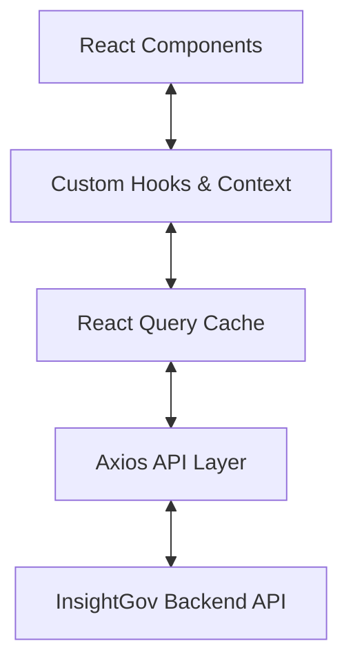

# InsightGov AI - Frontend Integration Guide

## 1. Overview
The InsightGov AI Frontend is a responsive, role-based web application designed to facilitate modern petition management. Its primary purpose is to provide an intuitive interface for citizens to submit and track petitions, for government officers to review AI-analyzed petitions and make decisions, and for administrators to monitor platform-wide analytics and manage accounts.

**Responsibilities:**
- Provide role-specific dashboards and workflows (Citizen, Officer, Admin).
- Intelligently present AI-generated insights (priority, categorization, duplication, reasoning) without directly calling AI services.
- Handle state management and API communication with the backend system securely.
- Ensure a cohesive, professional "government aesthetic" using a robust design system.

**Architecture:**
The application uses a Single Page Application (SPA) architecture. It relies on a central API service for all data.


**Folder Structure Overview:**
The frontend resides entirely within the `frontend/` directory, utilizing a modular, feature-grouped structure under `src/`.

---

## 2. Technology Stack
- **React (v18)**: Core library for building the user interface.
- **Vite**: Ultra-fast build tool and development server.
- **Tailwind CSS**: Utility-first CSS framework used for rapid, consistent styling without leaving the markup.
- **shadcn/ui (Conceptual)**: While full shadcn packages aren't installed, the *design philosophy* of shadcn is implemented natively via custom Tailwind utility classes (`index.css`) for cards, badges, and buttons.
- **React Router**: Client-side routing to handle navigation between role-based views.
- **React Query (@tanstack/react-query)**: Handles asynchronous state management, caching, polling, and data synchronization with the backend.
- **Axios**: Configured with interceptors for global authentication (JWT) and error handling.
- **Recharts**: Lightweight, customizable charting library used for admin analytics.
- **React Leaflet (leaflet)**: Provides interactive map visualizations for petition locations.
- **Lucide React**: Modern, clean SVG icon library.
- **clsx / tailwind-merge**: Used in the `cn()` utility to safely compose dynamic Tailwind classes.

---

## 3. Project Structure
The `frontend/src/` directory is organized as follows:

- `api/`: Contains Axios instance setup and API service modules (`auth.api.js`, `petitions.api.js`, etc.). Responsible for HTTP calls.
- `components/`: Reusable UI components.
  - `layout/`: App structure (`Navbar`, `Sidebar`, `PageWrapper`).
  - `petition/`: Domain-specific components (`PetitionCard`, `PetitionForm`, `PetitionTable`, `StatusTimeline`).
  - `ai/`: Components dedicated to rendering AI insights (`AIAnalysisPanel`, `PriorityBadge`, etc.).
  - `charts/` & `map/`: Data visualization components.
- `pages/`: Route-level components grouped by role (`public/`, `citizen/`, `officer/`, `admin/`).
- `router/`: Contains `AppRouter.jsx` and `ProtectedRoute.jsx` for access control.
- `hooks/`: Custom React hooks, primarily wrapping React Query (e.g., `usePetitions.js`).
- `context/`: Global React context, specifically `AuthContext.jsx` for user session management.
- `lib/`: Utility functions (`utils.js` for formatting, class merging).
- `assets/`: Static assets (if any).

---

## 4. Routing
The application uses role-based routing. Protected routes redirect unauthorized users to the login page.

| URL | Page Component | Role | Authentication |
| :--- | :--- | :--- | :--- |
| `/` | `LandingPage` | Any | None |
| `/login` | `LoginPage` | Any | None |
| `/register` | `RegisterPage` | Any | None |
| `/citizen/dashboard` | `CitizenDashboard` | `citizen` | Required |
| `/citizen/petitions/new` | `SubmitPetition` | `citizen` | Required |
| `/citizen/petitions/:id` | `PetitionStatus` | `citizen` | Required |
| `/officer/dashboard` | `OfficerDashboard` | `officer` | Required |
| `/officer/petitions/:id`| `PetitionReview` | `officer` | Required |
| `/admin/dashboard` | `AdminDashboard` | `admin` | Required |
| `/admin/departments` | `DepartmentManagement`| `admin` | Required |
| `/admin/officers` | `OfficerManagement` | `admin` | Required |

---

## 5. API Integration
The frontend expects a RESTful API. Below are the consumed endpoints:

**Auth API (`/auth`)**
- `POST /auth/login`: Authenticates user. Requires `{ email, password }`. Returns `{ token, user }`. Used by `LoginPage`.
- `POST /auth/register`: Registers citizen. Requires `{ name, email, password }`. Returns `{ token, user }`. Used by `RegisterPage`.
- `GET /auth/me`: Fetches profile. Used on initial load if token exists.

**Petitions API (`/petitions`)**
- `GET /petitions`: Fetches petitions. Accepts query params (`citizen_id`, `department`). Used by `usePetitions` in dashboards.
- `GET /petitions/:id`: Fetches a single petition. Used by `usePetition` in `PetitionStatus` and `PetitionReview`. (Polls every 5s if status is 'pending').
- `POST /petitions`: Submits a petition. Requires `{ title, description, location }`. Used by `SubmitPetition`.
- `PATCH /petitions/:id`: Updates a petition. Requires `{ status, notes, [department], [priority] }`. Used by `PetitionReview`.

**AI API (`/ai`)**
- `POST /ai/search`: Semantic search. Requires `{ query, top_k }`. Used in `OfficerDashboard` via `useSemanticSearch`.

**Analytics API (`/analytics`)**
- `GET /analytics`: Fetches platform stats. Returns `{ stats, charts, mapData }`. Used by `AdminDashboard`.

**Admin API (`/admin`)**
- `GET /admin/departments`: Fetches departments. Used by `DepartmentManagement`, `OfficerManagement`.
- `POST /admin/departments`: Creates dept. Requires `{ name }`.
- `GET /admin/officers`: Fetches officers. Used by `OfficerManagement`.
- `POST /admin/officers`: Creates officer. Requires `{ name, email, password, department_id }`.

**Notifications API (`/notifications`)**
- `GET /notifications`: Polls for unread notifications every 30s.

---

## 6. Authentication
- **Storage**: JWT tokens and user objects are stored in browser `localStorage` (`insightgov_token`, `insightgov_user`).
- **Flow**: `login()` updates Context and saves to localStorage. The Axios instance interceptor attaches the token to the `Authorization: Bearer <token>` header of every request.
- **Role-based Routing**: `ProtectedRoute` checks `isAuthenticated` and verifies if the user's `role` matches the `allowedRoles` prop. If it fails, it redirects appropriately.
- **Logout/Expiration**: A global Axios response interceptor catches `401 Unauthorized` responses, clears localStorage, and forcefully redirects the user to `/login`. Token refresh is not currently implemented natively on the frontend (relies on long-lived tokens or re-login).

---

## 7. State Management
- **React Context (`AuthContext`)**: Used exclusively for global authentication state (`user`, `token`, `role`).
- **React Query**: Used for all remote server state. It handles fetching, caching, invalidation, and polling. 
  - *Example*: `usePetition` polls the backend every 5 seconds if a petition's status is `pending` to wait for AI analysis to complete.
- **Local State (`useState`)**: Used for ephemeral component state, such as form inputs, dropdown toggles, and search query strings.

---

## 8. UI Components

- **Layouts**
  - `Navbar`: Top navigation. Shows user profile, notifications, and mobile menu toggle.
  - `Sidebar`: Role-contextual side navigation.
  - `PageWrapper`: Wraps children in the standard layout grid.
- **Petition Components**
  - `PetitionCard`: Summarized view of a petition for lists.
  - `PetitionForm`: Form for citizens to submit petitions.
  - `PetitionTable`: Tabular view of petitions used in Officer/Admin queues.
  - `StatusTimeline`: Visual representation of a petition's history array.
- **AI Components**
  - `AIAnalysisPanel`: Orchestrates the display of AI data. Read-only for citizens, interactive for officers.
  - `ExplainabilityPanel`: Collapsible panel showing the reasoning behind the AI's department, priority, and category decisions.
  - `DuplicateAlert`: Warning banner showing potential duplicates with similarity scores.
  - `PriorityBadge` & `ConfidenceBar`: Visual indicators.
- **Data Visualizations**
  - `PetitionsByCategory`, `PetitionsByStatus`, `PetitionsOverTime`: Recharts wrappers accepting API chart data.
  - `PetitionMap`: Leaflet map plotting petitions by lat/lng coordinates, color-coded by priority.

---

## 9. AI UI Integration
**CRITICAL NOTE**: The frontend *never* communicates directly with an LLM or AI service. It strictly consumes structured JSON data returned by the backend's `/petitions` endpoints.

The AI data is expected in a nested `ai_analysis` object on the petition record. It is displayed as follows:
- **Priority**: Shown via `PriorityBadge` (Critical/High/Medium/Low).
- **Category & Department**: Displayed as pills or text labels.
- **Confidence**: Rendered as an animated progress bar. If `< 0.70`, it turns amber to warn officers.
- **Explanation**: A nested JSON object containing `department_reasoning`, `priority_reasoning`, etc. Rendered in the `ExplainabilityPanel`.
- **Duplicate Detection**: An array of `duplicates` containing `score` and `petition_id`. Rendered by `DuplicateAlert`.

Citizens see a simplified, read-only view of this data. Officers see the full data and have UI controls to explicitly override the AI's Department and Priority suggestions during the review process.

---

## 10. Backend Integration Requirements
The frontend expects the backend to adhere to the following contracts:

**1. Petition Object Structure:**
The backend must return petitions with the following shape:
```json
{
  "id": "uuid",
  "title": "string",
  "description": "string",
  "location": "string",
  "lat": 20.59,
  "lng": 78.96,
  "status": "pending | analysed | under_review | resolved | rejected | duplicate",
  "department": "string | null",
  "priority": "string | null",
  "created_at": "iso-date-string",
  "history": [
    { "status": "string", "notes": "string", "created_at": "iso-string" }
  ],
  "ai_analysis": {
    "priority": "critical | high | medium | low",
    "category": "string",
    "department": "string",
    "confidence_score": 0.85,
    "explanation": {
      "department_reasoning": "string",
      "priority_reasoning": "string"
    },
    "duplicates": [
      { "petition_id": "uuid", "score": 0.92, "title": "string" }
    ]
  }
}
```

**2. Asynchronous AI Processing:**
When a citizen submits a petition, the backend should immediately return the petition with `status: "pending"`. The frontend will automatically poll the `GET /petitions/:id` endpoint every 5 seconds until the status changes from `pending` to `analysed` (indicating AI processing is complete).

**3. Error States:**
The backend must return consistent JSON errors, specifically utilizing a `detail` key for human-readable error messages (e.g., `{"detail": "Invalid credentials"}`).

---

## 11. Environment Variables
The application uses Vite's environment variable system.
- `VITE_API_BASE_URL`: The URL of the backend API server. If not provided, it defaults to `http://localhost:8000`.

To set this locally, create a `.env` file in the `frontend/` directory:
```env
VITE_API_BASE_URL=http://localhost:8000/api/v1
```

---

## 12. Build & Run
Ensure Node.js 18+ is installed.

```bash
# Install dependencies
npm install

# Start development server (with hot module replacement)
npm run dev

# Create production build
npm run build

# Preview production build locally
npm run preview
```

---

## 13. Deployment Notes
- **Static Hosting**: The `dist/` directory generated by `npm run build` is purely static HTML/CSS/JS. It can be hosted on any static provider (Vercel, Netlify, AWS S3, Nginx).
- **Routing Fallback**: Because this is a React SPA using React Router, the static web server *must* be configured to redirect all 404 requests to `index.html`.
- **Environment Variables**: `VITE_API_BASE_URL` must be set *at build time* in the CI/CD pipeline. Vite embeds this variable into the minified Javascript.

---

## 14. Testing Checklist
To verify the frontend implementation:
- [ ] **Authentication**: Register a citizen. Log out. Log back in. Attempt to navigate to `/officer/dashboard` manually to verify the redirect.
- [ ] **Submission & Polling**: Submit a petition. Verify the UI enters a loading state. Manually update the backend DB to change the status to `analysed`, and verify the frontend automatically updates without a page refresh.
- [ ] **Officer Action**: Log in as an officer. Open a petition. Use the override panel to change the department, then resolve the petition. Verify the timeline updates.
- [ ] **Semantic Search**: Use the search bar on the Officer dashboard.
- [ ] **Admin Analytics**: Log in as admin. Verify Recharts render data correctly and the Leaflet map displays pins.

---

## 15. Known Limitations
- Token refresh is not implemented; users must re-authenticate if the JWT expires.
- The Leaflet map currently uses the petition's raw `lat`/`lng` provided by the backend. The frontend does not currently implement a geocoding feature (converting a string location to lat/lng) on submission; it relies on the backend to append these coordinates.
- Unread notifications are polled every 30s. Real-time WebSockets are not implemented.

---

## 16. Future Improvements

**Current Implementation**
- Standard JWT localStorage authentication.
- 5s polling for AI analysis completion.
- Recharts and Leaflet for visualization.

**Possible Future Improvements**
- **WebSockets/SSE**: Replace polling with Server-Sent Events or WebSockets for instant UI updates when AI analysis completes or new petitions arrive.
- **Map Geocoding**: Add a map picker to `PetitionForm` so citizens can drop a pin for exact coordinates.
- **Image Attachments**: Support uploading images of issues via AWS S3 or a local backend store.
- **Progressive Web App (PWA)**: Configure Vite PWA plugin to allow citizens to install the app on their mobile devices for offline access.
